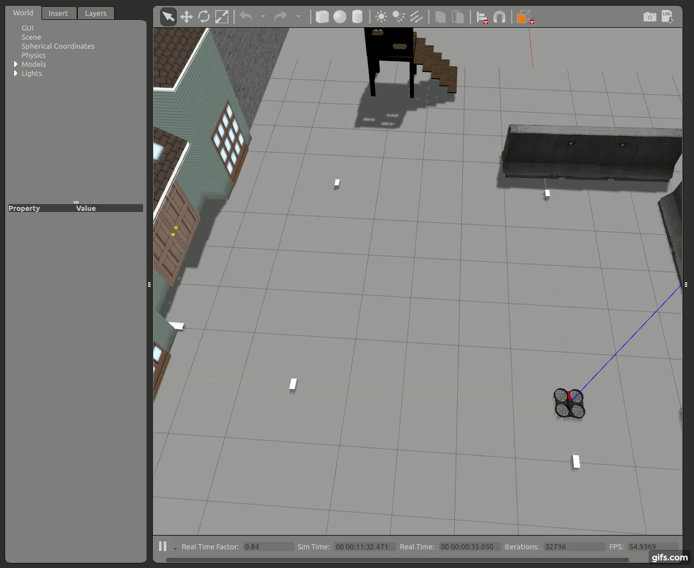

# Abstract 

The aim of this project is to provide a solution for autonomous indoor drone (AID). AID involves localization, control, path planning and autonomous landing/take-off. A robust localization method was used, using GPS-like device called DWM1001 provided by Decawave . This device is especially useful for indoor applications as it a has a high accuracy and can only be used in confined spaces.

### Aim

### Prototype in Gazebo 7

### Rviz visualization of DWM1001 network 

## DWM1001 dev-boards

# Packages
**`localizer_dwm1001`** This package is responsible on getting the network coordinates (tag and anchors) from dwm1001 dev board via USB, and pubblish in coordinates in topics.

**`fyp`** This package is responsible on controlling the drone, reading waypoints from xml file, process joystick input, land and takeoff the drone.

**`ardrone_simulator`** This package is responsible on simulating the ardrone on gazebo7.

**`joy`** This package is responsible on interfacing joystick.

**`generate_map`** This package is responsible on creating markers in Rviz.

Other packages were made for testing(I will remove them once I get a working prototype on the real drone)

## Dynamic reconfigure of DWM1001
In this package we want to be able to change some variable from ground station, while the drone is flying.

## ROS Topic monitor

### Roadmap
- [x] Create RTLS network from Android App
- [x] Access DWM1001 API via UART
- [x] Get Anchor coordinates in Python
- [x] Get Tag position in Python
- [x] Display Anchors in RViz
- [x] Display Tag in RViz
- [x] Calculate shortest path from Tag to a Anchor using A* Algorithm
- [x] Display shortest path in RViz
- [ ] Display actual path in RViz
- [x] Dynamic configuration for DWM1001 dev board
- [ ] Dynamic configuration for drone
- [ ] Joystick controls for emergency takeoff and land
- [ ] Neural Network/AI that will manage flight controller after couple of laps
- [ ] Statistics for each lap
- [ ] Statistics for Neural Network/AI
